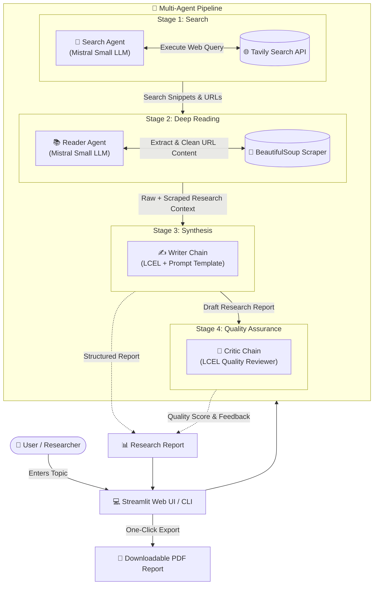
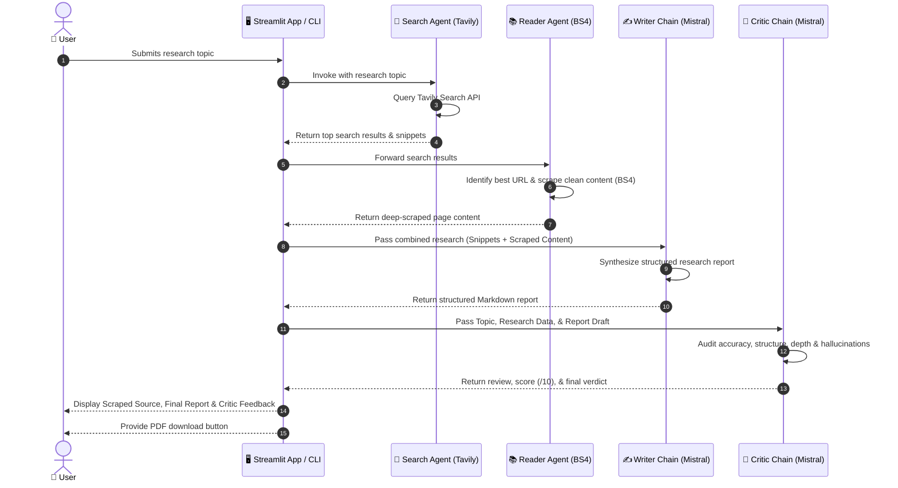

# 🤖 Multi-Agent AI Research System

> An intelligent, autonomous multi-agent research assistant built with **LangChain**, **Mistral AI**, **Tavily Search**, **BeautifulSoup**, and **Streamlit**.


---

## 📖 Overview

The **Multi-Agent AI Research System** is an end-to-end research solution designed to automate comprehensive web research and document synthesis. Rather than relying on a single prompt or LLM query that may suffer from hallucinations or shallow answers, this system divides the research workflow across specialized, collaborative AI agents and chains:

1. **🔎 Search Agent**: Queries the live web using Tavily API to identify credible sources, titles, and snippets.
2. **📚 Reader Agent**: Analyzes search outputs, selects the highest-relevance target URL, and scrapes clean full-page textual content via BeautifulSoup.
3. **✍️ Writer Chain**: Synthesizes combined search snippets and scraped deep content into a structured, publication-ready research report.
4. **🧐 Critic Agent**: Evaluates the drafted report against strict quality benchmarks (accuracy, depth, hallucinations, citations, and structure), assigning scores and actionable feedback.

The system features an interactive **Streamlit dashboard** with step-by-step progress tracking and **PDF report export** capabilities.

---

## 🏗️ Architecture & Workflows

### High-Level System Architecture



---

### Sequence Execution Flow



---

## ✨ Key Features

- **Multi-Agent Orchestration**: Modular agent separation with specialized responsibilities for searching, reading, writing, and reviewing.
- **Real-Time Web Intelligence**: Powered by the **Tavily Search API** for accurate, up-to-date, and domain-relevant search results.
- **Deep Web Extraction**: Intelligent DOM extraction using **BeautifulSoup4** (stripping scripts, styles, navigation, and footers for clean context).
- **LCEL Prompt Pipelines**: Robust LangChain Expression Language pipelines (`writer_chain` and `critic_chain`) with zero-temperature inference for high factual consistency.
- **Comprehensive Quality Assurance**: Built-in Critic agent scoring out of 10, checking for hallucinations, missing information, and structural rigor.
- **Interactive Web Interface**: Streamlit UI with animated gradient hero headers, reactive status step indicators, and dark glassmorphic cards.
- **One-Click PDF Generation**: Export finalized research reports into cleanly formatted PDF documents directly from the browser.

---

## 🛠️ Tech Stack

| Category | Technology | Purpose |
| :--- | :--- | :--- |
| **Language** | Python 3.11+ | Core programming runtime |
| **Orchestration** | LangChain / LCEL | Agent creation, prompt chaining, and output parsing |
| **LLM Provider** | Mistral AI (`mistral-small-2603`) | Reasoning, synthesis, and critical evaluation |
| **Web Search** | Tavily API | Real-time web index search and metadata retrieval |
| **Scraping** | BeautifulSoup4 & Requests | Targeted HTML parsing, cleaning, and text extraction |
| **Web App UI** | Streamlit | Responsive dashboard with modern custom styling |
| **Document Export** | FPDF2 | Automated Markdown to PDF compilation |
| **Configuration** | `python-dotenv` | Secure API key and environment variable management |

---

## 📂 Project Structure

```text
MultiAgent_ResearchSystem/
├── agents.py           # Agent definitions (Search Agent, Reader Agent, Writer Chain, Critic Chain)
├── app.py              # Streamlit web application with modern UI & PDF export
├── pipeline.py         # Sequential multi-agent pipeline orchestrator & CLI runner
├── tools.py            # Custom LangChain tools (Tavily web search & BS4 URL scraper)
├── requirements.txt    # Python package dependencies
├── .env.example        # Example environment configuration template
└── README.md           # Project documentation and architecture guide
```

---

## 🚀 Getting Started

### 1. Clone the Repository

```bash
git clone https://github.com/Abhishek-Royy/multiAgentResearchSystem.git
cd multiAgentResearchSystem
```

### 2. Create and Activate Virtual Environment

```bash
# Windows
python -m venv .venv
.venv\Scripts\activate

# Linux / macOS
python3 -m venv .venv
source .venv/bin/activate
```

### 3. Install Dependencies

```bash
pip install -r requirements.txt
```

### 4. Configure Environment Variables

Create a `.env` file in the root directory and provide your API keys:

```env
MISTRAL_API_KEY=your_mistral_api_key_here
TAVILY_API_KEY=your_tavily_api_key_here
```

> **Where to get keys:**
> - [Mistral AI Console](https://console.mistral.ai/)
> - [Tavily AI Platform](https://tavily.com/)

---

## 💻 Usage

### Run via Streamlit UI (Recommended)

Start the interactive web dashboard:

```bash
streamlit run app.py
```

Open your browser at `http://localhost:8501`, enter a research topic, and click **🚀 Run Research**.

---

### Run via Command Line Interface (CLI)

Run the autonomous pipeline directly in your terminal:

```bash
python pipeline.py
```

You will be prompted to enter a research topic:
```text
Enter a research topic: Latest developments in fusion energy 2026
```

---

## 📋 Generated Report Structure

The Writer Agent formats research reports according to this standard:

1. **Title** — Concise and descriptive header
2. **Executive Summary** — 3–5 sentence high-level overview
3. **Introduction** — Core importance and context
4. **Background** — Relevant domain background
5. **Key Findings** — 4–6 detailed, evidenced insights
6. **Analysis** — Patterns, comparative viewpoints, and implications
7. **Conclusion** — Summary of key takeaways
8. **Future Outlook** — Emerging developments, challenges, and opportunities
9. **References** — Verified source URLs gathered from real-time searches

---

## 📄 License

This project is licensed under the MIT License — see the [LICENSE](LICENSE) file for details.